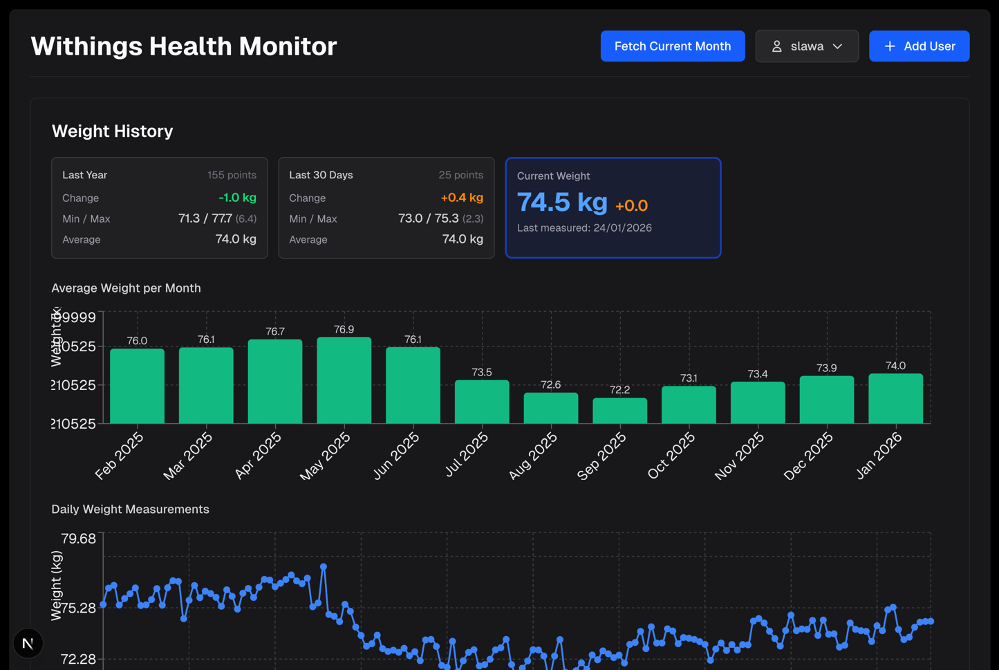

# Withings Health Monitor

A Next.js application to connect to Withings health devices and monitor your health data.

## Features

- 🔐 OAuth 2.0 integration with Withings API
- 📊 Fetch and display health measurements
- 💾 Local data storage organized by user and month
- 🗂️ Data persistence in JSON format



## Setup

1. **Install dependencies:**
   ```bash
   npm install
   ```

2. **Configure Withings credentials:**
    - Create a Withings Developer account at [https://developer.withings.com](https://developer.withings.com)
    - Create a new application
    - Add your credentials to `.env`:
      ```
      WITHINGS_CLIENT_ID=your_client_id
      WITHINGS_CLIENT_SECRET=your_client_secret
      WITHINGS_REDIRECT_URI=http://localhost:3000/api/auth/callback
      ```

3. **Run the development server:**
   ```bash
   npm run dev
   ```

4. **Open [http://localhost:3000](http://localhost:3000)**

## Usage

### Web Application

1. Click "Connect Withings Account"
2. Authorize the app on Withings
3. Click "Get Measurements" to fetch your health data

### Fetch Historical Data

To fetch and store a full year of data locally:

1. **Update `.env.json` with your tokens:**

   **Multi-user format (recommended):**
   ```json
   {
     "slawa": {
       "access_token": "your_access_token",
       "refresh_token": "your_refresh_token",
       "userid": "1372655",
       "expires_in": "10800"
     },
     "xxx": {
       "access_token": "another_access_token",
       "refresh_token": "another_refresh_token",
       "userid": "1234567",
       "expires_in": "10800"
     }
   }
   ```

   **Legacy single-user format:**
   ```json
   {
     "access_token": "your_access_token",
     "refresh_token": "your_refresh_token",
     "userid": "your_user_id"
   }
   ```

2. **Run the fetch script:**

   **Multi-user format:**
   ```bash
   npm run fetch-year slawa 2024
   ```

   Or without specifying year (uses current year):
   ```bash
   npm run fetch-year slawa
   ```

   **Legacy format:**
   ```bash
   npm run fetch-year 2024
   ```

This will:

- Fetch data month by month for the specified year
- Store each month in `data/{userid}/{YYYY-MM}.json`
- Skip months that already exist locally
- Display a summary of the operation

### Automated Data Fetching (Cronjob)

To automatically fetch the current month's data for all users:

```bash
npm run fetch-all
```

This will:

- Fetch current month data for all users in `.env.json`
- Automatically refresh expired tokens
- Update tokens in `.env.json` if refreshed
- Continue with other users if one fails

To set up automated fetching with a cronjob, see [docs/CRONJOB_SETUP.md](docs/CRONJOB_SETUP.md) for detailed
instructions.

**Example cronjob (runs daily at 3 AM):**

```bash
0 3 * * * cd /path/to/nextjs-withings-monitor && npm run fetch-all >> /tmp/withings-fetch.log 2>&1
```

### Data Structure

Data is stored in the following structure:

```
data/
  └── {userid}/
      ├── 2024-01.json
      ├── 2024-02.json
      └── ...
```

Each file contains:

```json
{
  "userid": "1372655",
  "year": 2024,
  "month": 1,
  "fetchedAt": "2026-01-02T22:26:18.446Z",
  "measurements": {
    "updatetime": 1766048364,
    "measuregrps": [
      ...
    ]
  }
}
```

## API Routes

- `/api/auth/withings` - Initiates OAuth flow
- `/api/auth/callback` - OAuth callback handler
- `/api/measurements` - Fetch measurements endpoint

## Libraries

### `lib/withings.ts`

Core Withings API functions

### `lib/withings-dao.ts`

Data Access Object for local storage

## Scripts

- `npm run dev` - Start development server
- `npm run build` - Build for production
- `npm run fetch-year [username] [year]` - Fetch historical data for a specific user and year
- `npm run fetch-all` - Fetch current month data for all users (designed for cronjobs)
- `npm run validate-env` - Validate environment configuration

## Notes

⚠️ **Token Expiry**: Access tokens expire after 3 hours. Use the refresh token to get a new one.

⚠️ **Rate Limiting**: The fetch script includes a 500ms delay between requests.

---

This is a [Next.js](https://nextjs.org) project bootstrapped with [
`create-next-app`](https://nextjs.org/docs/app/api-reference/cli/create-next-app).
